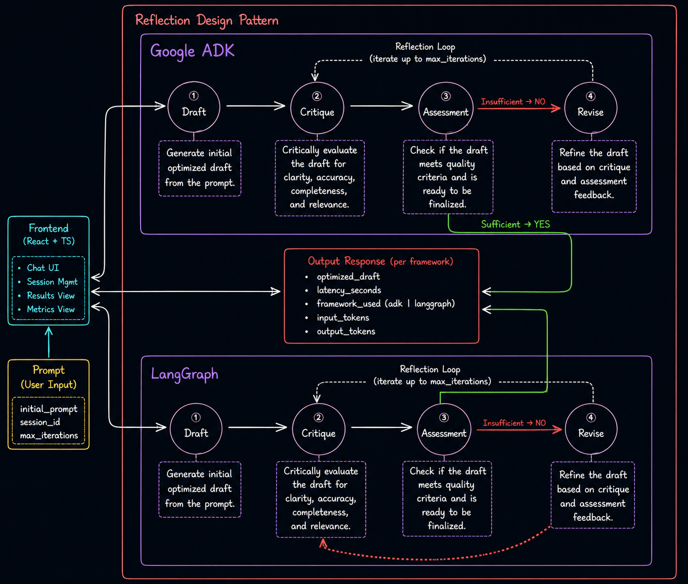

# 🚀 Prompt Optimiser Agent

> A comparative multi-agent AI system built using **Google ADK** and **LangGraph** to explore how different agent orchestration frameworks handle reflection-based prompt optimization workflows.

## 🌐 Live Demo

🔗 **Demo Application**  
https://prompt-optimiser-agent.vercel.app

📖 **Technical Article**  
https://medium.com/@mircofdo/should-we-use-google-adk-for-agentic-solutions-d659d710beb0

💻 **GitHub Repository**  
https://github.com/MircoFernando/prompt-optimiser-agent

---

## 📌 Overview

Prompt Optimiser Agent is a side project built to explore and compare two popular agent orchestration frameworks:

- Google ADK
- LangGraph

Instead of simply reading documentation, I implemented the **same multi-agent reflection workflow** using both frameworks and benchmarked their behavior under identical conditions.

The objective was not to determine a winner, but to better understand how different frameworks approach:

- Agent orchestration
- State management
- Multi-agent communication
- Reflection loops
- Runtime performance
- Iterative reasoning workflows

---

## 🏗️ Architecture

The system follows the **Reflection Design Pattern**, where specialized agents collaborate to iteratively improve a user's prompt.

### Agent Workflow

```text
User Prompt
      │
      ▼
┌────────────┐
│ Generator  │
└─────┬──────┘
      ▼
┌────────────┐
│  Critic    │
└─────┬──────┘
      ▼
┌────────────┐
│ Assessor   │
└─────┬──────┘
      │
      ├── Sufficient → Return Result
      │
      ▼
┌────────────┐
│  Reviser   │
└─────┬──────┘
      │
      └───────────────► Reflection Loop
```

### Specialized Agents

| Agent | Responsibility |
|---------|--------------|
| Generator | Creates an initial optimized prompt |
| Critic | Reviews the prompt and identifies weaknesses |
| Assessor | Determines whether quality requirements are met |
| Reviser | Refines the prompt using feedback |

---

## 🖼️ System Design

The same reflection architecture was implemented using both frameworks.



---

## ⚙️ Technology Stack

### Frontend

- React
- TypeScript
- Vite

### Backend

- Python
- FastAPI
- AsyncIO

### AI & Agent Frameworks

- Google ADK
- LangGraph
- Gemini
- OpenAI

### Concepts Explored

- Multi-Agent Systems
- Reflection Design Pattern
- Agent Orchestration
- State Management
- Session Management
- Prompt Optimization
- Performance Benchmarking

---

## 🔄 Framework Implementations

### Google ADK

The ADK implementation uses a more imperative orchestration approach where agents are coordinated through native control-flow constructs.

Features:

- Session-based memory management
- Async agent execution
- Reflection loop orchestration
- Token tracking
- Latency benchmarking

### LangGraph

The LangGraph implementation models the workflow as an explicit state graph.

Features:

- StateGraph orchestration
- Conditional routing
- Checkpoint-based memory
- Revision history tracking
- Token tracking
- Latency benchmarking

---

## 📊 Example Benchmark

Input:

```json
{
  "initial_prompt": "make a portfolio website, its for an AI engineer",
  "max_iterations": 3,
  "session_id": "1"
}
```

### LangGraph

| Metric | Value |
|----------|---------|
| Input Tokens | 3102 |
| Output Tokens | 1648 |
| Revision Count | 3 |
| Latency | 32.52s |

### Google ADK

| Metric | Value |
|----------|---------|
| Input Tokens | 961 |
| Output Tokens | 971 |
| Revision Count | 1 |
| Latency | 8.42s |

> **Note:** Results may vary depending on prompt complexity, model behavior, session memory, and workflow configuration.

---

## 🎯 Key Learnings

Building the same system twice provided valuable insight into the trade-offs between graph-based and imperative approaches to agent orchestration.

Some observations from the project:

- ADK felt faster to prototype and iterate with.
- LangGraph provided a more structured workflow model.
- State management strategies differ significantly between frameworks.
- Reflection loops can amplify orchestration overhead.
- Framework architecture can influence both developer experience and runtime behavior.

Most importantly:

> There is no universal winner. The best framework depends on the requirements, complexity, and operational needs of the system being built.

---

## 📂 Project Structure

```text
prompt-optimiser-agent/
│
├── backend/
│   ├── src/
│   │   ├── frameworks/
│   │   │   ├── adk/
│   │   │   └── langgraph/
│   │   ├── api/
│   │   ├── services/
│   │   └── utils/
│
├── frontend/
│   └── prompt-optimiser-frontend/
│
├── docs/
│   └── system-design.png
│
└── README.md
```

---

## 🚀 Running Locally

### Backend

```bash
cd backend

pip install -r requirements.txt

uvicorn src.main:app --reload
```

### Frontend

```bash
cd frontend/prompt-optimiser-frontend

npm install

npm run dev
```

---

## 📖 Further Reading

### Technical Deep Dive

If you're interested in the implementation details, benchmark results, and framework comparison:

📖 https://medium.com/@mircofdo/should-we-use-google-adk-for-agentic-solutions-d659d710beb0

---

## 🤝 Contributing

Contributions, suggestions, and discussions are welcome.

If you've experimented with Google ADK, LangGraph, CrewAI, AutoGen, or other agent frameworks, I'd love to hear your thoughts.

---

## 📜 License

MIT License

---

### Author

**Mirco Fernando**

AI Engineer | Machine Learning Engineer | Software Engineer

🌐 https://github.com/MircoFernando
