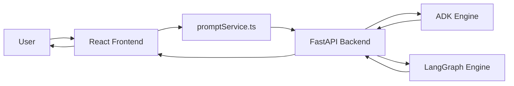

# Prompt Optimiser Agent - Application Guide

This document is the single place to understand how the application is wired end to end. It covers the backend, frontend, configuration, request flow, optimization engines, session handling, and the main implementation details that exist in the current codebase.

## 1. Product Overview

Prompt Optimiser Agent is a comparison-oriented prompt optimization app. A user enters a prompt in the frontend, the backend sends that prompt through two different optimization engines, and the UI displays both results side by side with latency and token metrics.

The two engines currently implemented are:

- Google ADK, implemented in `backend/src/frameworks/adk/loop.py`
- LangGraph, implemented in `backend/src/frameworks/langgraph/langraph_engine.py`

The app is built as a full stack system:

- Frontend: React + TypeScript + Vite
- Backend: FastAPI + Python services
- Model integration: OpenAI / OpenRouter style provider abstraction, plus Google-based runtime components for the ADK and LangGraph workflows
- Session management: in-memory demo storage on both engines

## 2. High-Level Architecture



Request flow:

1. The user types a prompt in the chat UI.
2. The frontend sends the prompt and `session_id` to both optimization endpoints.
3. The backend runs ADK and LangGraph in parallel as independent workflows.
4. Each workflow returns an optimized draft plus metrics.
5. The frontend renders both outputs in one message card.
6. After every 3 optimized prompts, the frontend clears the current session through the backend session-clear endpoint.

## 3. Repository Layout

Main areas of the repository:

- `backend/` - FastAPI application, engine logic, schemas, middleware, and utility services
- `frontend/prompt-optimiser-frontend/` - Vite React application with the chat interface
- `docs/` - project notes and the implementation guide

Important backend files:

- `backend/src/main.py` - FastAPI app bootstrap and CORS setup
- `backend/src/api/routers/router.py` - API routes
- `backend/src/services/agent_services.py` - service layer that connects routes to engine execution
- `backend/src/frameworks/adk/loop.py` - Google ADK optimization workflow
- `backend/src/frameworks/langgraph/langraph_engine.py` - LangGraph optimization workflow
- `backend/src/utils/config.py` - config loading, token counting, and helper utilities
- `backend/src/utils/llm_services.py` - model provider abstractions
- `backend/src/schemas/optimize_dto.py` - request and response schemas

Important frontend files:

- `frontend/prompt-optimiser-frontend/src/components/ui/ai-assistat.tsx` - main chat experience
- `frontend/prompt-optimiser-frontend/src/services/promptService.ts` - API client wrapper
- `frontend/prompt-optimiser-frontend/src/pages/AIchatbot.tsx` - page container for the chat demo
- `frontend/prompt-optimiser-frontend/.env` - frontend API base URL

## 4. Backend Application

### 4.1 Startup and middleware

`backend/src/main.py` creates the FastAPI app, loads environment variables with `python-dotenv`, registers error middleware, and enables CORS for the frontend origin.

The backend reads the frontend URL from `FRONTEND_URL` and uses it in `allow_origins`. That makes the React app the only allowed browser origin.

### 4.2 API routes

`backend/src/api/routers/router.py` exposes three endpoints under the `/api/v1/optimize` prefix:

- `POST /api/v1/optimize/adk`
- `POST /api/v1/optimize/langgraph`
- `POST /api/v1/optimize/session/clear`

The first two endpoints optimize a prompt using different engines. The third clears the session state for both in-memory implementations.

### 4.3 Service layer

`backend/src/services/agent_services.py` keeps route handlers thin. It receives DTOs, delegates work to the framework implementations, and converts engine return values into the API response schema.

This layer returns a normalized response object with:

- `optimized_draft`
- `latency_seconds`
- `framework_used`
- `input_tokens`
- `output_tokens`

### 4.4 Request and response schemas

`backend/src/schemas/optimize_dto.py` defines the API contract.

`PromptRequest` includes:

- `initial_prompt`
- `max_iterations`
- `session_id`

`OptimizationResponse` includes:

- `optimized_draft`
- `latency_seconds`
- `framework_used`
- `input_tokens`
- `output_tokens`

`SessionClearRequest` and `SessionClearResponse` are used by the reset endpoint.

### 4.5 Configuration and environment handling

`backend/src/utils/config.py` is responsible for:

- loading `.env`
- reading YAML config files from `backend/config/`
- resolving provider and model settings
- validating required environment variables
- counting tokens for prompt/response pairs

Relevant backend config files:

- `backend/config/params.yaml` - provider, temperature, max tokens, chunking, retrieval, logging, and path settings
- `backend/config/models.yaml` - model mapping per provider and tier

Environment variables expected by the backend:

- `OPENAI_API_KEY` when `provider.default` is set to `openai`
- `OPENROUTER_API_KEY` when `provider.default` is set to `openrouter`
- `TAVILY_API_KEY` for web/search-related functionality required by the config validator
- `FRONTEND_URL` for CORS configuration in `backend/src/main.py`

### 4.6 Model provider abstraction

`backend/src/utils/llm_services.py` defines provider classes and the factory used by the engine code.

Implemented providers:

- `OpenAIProvider`
- `OpenRouterProvider`
- `DummyLocalProvider`

The current code path used by LangGraph calls `create_llm_provider()` so the backend can resolve the active provider from config.

### 4.7 Token and latency metrics

`backend/src/utils/config.py` contains reusable token utilities. The engines use these helpers to compute:

- input tokens
- output tokens
- total token usage in the local workflow

The ADK and LangGraph engines both return token counts, and the frontend displays them in the chat output.

## 5. Google ADK Implementation

The ADK engine is implemented in `backend/src/frameworks/adk/loop.py`.

### 5.1 Session handling

The ADK workflow uses `InMemorySessionService`, which makes it simple for demos but not persistent across backend restarts.

Session identity is controlled by:

- `APP_NAME`
- `USER_ID`
- `SESSION_ID`

The current API path also allows a dynamic `session_id` to be passed through request bodies so each frontend session can be isolated.

### 5.2 Agents

The ADK workflow is implemented as four agents:

- `draft_agent`
- `critic_agent`
- `assessment_agent`
- `revise_agent`

The loop does the following:

1. Draft an improved prompt
2. Critique that draft
3. Assess whether the critique is sufficient
4. Revise if needed
5. Repeat until the draft is sufficient or the iteration limit is reached

### 5.3 Execution path

`execute_adk_optimization()`:

- initializes or reuses a session
- creates a `Runner`
- sends a draft request to the generator agent
- iterates through critic / assess / revise cycles
- accumulates token counts
- returns the final prompt plus metrics

### 5.4 Session clearing

`clear_adk_session()` removes the stored session from the in-memory session service.

This is used by the backend session-clear endpoint and by the frontend after the third optimized prompt.

## 6. LangGraph Implementation

The LangGraph engine is implemented in `backend/src/frameworks/langgraph/langraph_engine.py`.

### 6.1 State model

The workflow uses a `ReflectionState` typed dictionary containing:

- `query`
- `current_draft`
- `critique`
- `revision_history`
- `messages`
- `is_sufficient`
- `iteration`
- `max_iterations`
- `total_tokens`
- `input_tokens`
- `output_tokens`

### 6.2 Graph nodes

The graph contains these nodes:

- `Draft`
- `Critic`
- `Assess`
- `Revise`

The graph flow is:

1. Draft initial output
2. Critic evaluates the draft
3. Assess decides whether to stop
4. Revise updates the draft when needed
5. Loop back until the draft is sufficient or the max iteration count is reached

### 6.3 Checkpointing and memory

LangGraph uses `MemorySaver` as its checkpoint store.

This means:

- the workflow can keep thread-scoped state during a session
- the memory is still ephemeral and cleared on restart
- the `session_id` maps to LangGraph `thread_id` through the runtime config

### 6.4 Execution path

`execute_langgraph_optimization()`:

- builds a thread config from `session_id`
- initializes the first state object
- invokes the graph asynchronously
- collects token and revision metrics
- returns the final draft and metric values

### 6.5 Session clearing

`clear_langgraph_session()` deletes the stored checkpoint data for the current session from the in-memory store.

## 7. Frontend Application

### 7.1 UI entry point

`frontend/prompt-optimiser-frontend/src/pages/AIchatbot.tsx` renders the main chat page and mounts the chat component.

### 7.2 Chat component behavior

The main experience is implemented in `frontend/prompt-optimiser-frontend/src/components/ui/ai-assistat.tsx`.

What it does:

- keeps a unique `sessionId` per browser session
- stores a message list and typing state
- submits user prompts to both engines in parallel
- shows the two results side by side
- displays latency and token counts for each engine
- seeds a welcome message on first load
- clears session memory after the third optimized prompt

### 7.3 Frontend API wrapper

`frontend/prompt-optimiser-frontend/src/services/promptService.ts` contains the Axios calls to the backend.

It defines three service groups:

- `promptServiceADK.optimize()`
- `promptServiceLangGraph.optimize()`
- `promptServiceSession.clear()`

The frontend expects the API base URL from `VITE_API_BASE_URL` in the Vite `.env` file.

### 7.4 Frontend environment variable

`frontend/prompt-optimiser-frontend/.env` contains:

- `VITE_API_BASE_URL=http://127.0.0.1:8000/api/v1/optimize`

This value should be used by the frontend service layer so the app can target different backend URLs without changing source code.

### 7.5 UI composition

The current UI includes:

- a full-screen chat container
- a custom background image
- a translucent overlay for contrast
- a centered conversation panel
- a message composer at the bottom
- loading feedback while optimization runs
- a responsive side-by-side engine comparison layout

## 8. End-to-End Runtime Flow

### 8.1 When a user sends a prompt

1. The user types into the input box and submits.
2. The frontend creates a user message bubble immediately.
3. If the input matches a simple conversational trigger like hello or help, the UI returns a canned chat response.
4. Otherwise, the app calls both optimization endpoints in parallel.
5. The backend runs the ADK and LangGraph workflows.
6. The frontend receives both responses and renders them together.

### 8.2 Session management behavior

The frontend tracks the number of optimized prompts only.

After the third optimization request, it calls the session-clear endpoint to reset both in-memory engines.

This gives the demo a predictable session lifecycle without making the code heavy.

### 8.3 Output formatting

Each engine response includes:

- the optimized draft
- latency in seconds
- input token count
- output token count

The frontend renders those metrics underneath each engine result.

## 9. Configuration and Secrets

### 9.1 Backend `.env`

The backend uses environment variables for provider access and CORS configuration.

Expected values include:

- `OPENAI_API_KEY`
- `OPENROUTER_API_KEY`
- `TAVILY_API_KEY`
- `FRONTEND_URL`

### 9.2 Frontend `.env`

The frontend uses:

- `VITE_API_BASE_URL`

### 9.3 Important runtime caveat

The backend currently uses in-memory session storage. That means:

- sessions disappear on restart
- memory is not shared across machines
- this is suitable for demos and local development, not production persistence

## 10. Dependency Summary

Backend dependencies in `requirements.txt`:

- `fastapi`
- `uvicorn`
- `pydantic`
- `google-adk`
- `google-genai`
- `langgraph`
- `langchain-google-genai`
- `python-dotenv`
- `PyYAML`
- `openai`
- `tiktoken`

Frontend dependencies are managed under `frontend/prompt-optimiser-frontend/package.json` and include the React/Vite runtime, Axios, and UI helpers used by the chat experience.

## 11. How to Run Locally

Backend:

```bash
cd backend
source ../.venv/bin/activate
uvicorn src.main:app --reload
```

Frontend:

```bash
cd frontend/prompt-optimiser-frontend
npm install
npm run dev
```

The frontend expects the backend to be available at the URL defined in `VITE_API_BASE_URL`.

## 12. API Examples

### 12.1 ADK optimization

```bash
curl -X POST http://127.0.0.1:8000/api/v1/optimize/adk \
  -H "Content-Type: application/json" \
  -d '{
    "initial_prompt": "Write a prompt to generate a creative story",
    "session_id": "demo-1",
    "max_iterations": 3
  }'
```

### 12.2 LangGraph optimization

```bash
curl -X POST http://127.0.0.1:8000/api/v1/optimize/langgraph \
  -H "Content-Type: application/json" \
  -d '{
    "initial_prompt": "Write a prompt to generate a creative story",
    "session_id": "demo-1",
    "max_iterations": 3
  }'
```

### 12.3 Clear session

```bash
curl -X POST http://127.0.0.1:8000/api/v1/optimize/session/clear \
  -H "Content-Type: application/json" \
  -d '{
    "session_id": "demo-1"
  }'
```

## 13. Notable Implementation Details

- The backend response contracts include token counts, and the frontend displays them directly.
- The chat UI keeps a per-browser session id so requests stay grouped together.
- The third optimized prompt triggers a session reset to keep the demo predictable.
- LangGraph uses thread-scoped checkpointing through the `session_id` passed from the frontend.
- ADK uses in-memory sessions, so session persistence is only for the current backend process.
- The codebase is intentionally structured as a benchmark demo rather than a production orchestration platform.

## 14. Known Constraints

- Session memory is ephemeral in both engines.
- The app is designed for local comparison and demonstration, not durable multi-tenant state.
- Some provider settings are selected from YAML config and require the correct environment variables to be present.
- The frontend hardcodes only the env variable name; the actual backend URL should be changed through `VITE_API_BASE_URL`.

## 15. Suggested Next Improvements

- Add persistent session storage for production use.
- Move the backend CORS origin list to support multiple allowed frontend URLs.
- Add automated tests for the API routes and engine response schemas.
- Add a demo script or screenshot guide for comparing the two engines.
- Add a short architecture diagram to the README that references this guide.

---

This guide reflects the current implementation of the repository as it exists now.